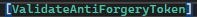

# Lucrarea Individuală

## 1. Instrucțiuni privind instalarea și pornirea proiectului.
Pentru a proni proiectul este necesara descărcarea la Microsoft Visual Studio, insuși a proiectului de pe git și executarea acestuia prin Visula studio facand click pe sageata verde cu "https": 

## 2. Autorul proiectului: 
Dorogan Vadim

## 3. Descrierea proiactului:
Aplicația este realizată folosind framework-ul ASP.NET core mvc și reprezintă o platformă de socializare.

Clasele-entități folosite pentru crearea tabelelor prin migrații: 
- FriendRelation (informația despre relații de prietenie a utilizatorilor)
- Post (datele postării ca: textul, imaginea, data, utilizatorul)
- PostImage (indexul imaginii, extensia, etc.)
- Profile (datele profilului: nume, prenume, etc.)
- ProfileImage (indexul imaginii, extensia, etc.)
- User (datele contului: email, parola, rol, etc.)

Controlere create: 
- AccountController
- HomeController
- AdminController

Ca roluri pot evidenția guest(oaspete), utilizator simplu și administrator.

În această aplicație este realizată: pagina de înregistrare, pagina de autentificare și deja paginile asociate paginii principale și panoul pentru administrator.

Acțiunile pot fi efectuate sunt: 
- înregistrarea și autentificarea pentru paginile legate de gestiunea conturilor.
- lăsarea unuei postări pe pagina principala (în cazul în care ele sunt setate ca publice), cautarea altor utilizatori, trimiterea cererii de prietenie, acceptarea cererii de prietenie, management-ul contului (datele ca nume, prenume, telefon, text despre utilizator, etc.) și vizualizarea postărilor utilizatorului daca acesta a intrat pe pagina de profila proprie sau a altor.
- schimbul de stare a contului pentru utilizatori care nu au rol de administrator in activ sau inactiv(în cazul în care contul este inactiv utilizatorul nu va putea accesa contul la autentificare).

## 4.Exemple de utilizare ale proiectului:
### 1. Înregistrare și autentificare.
În cazul înregistrării și autentificării este realizată validarea datelor și protecția împortriva atacurilor de tip SQL și XSS Injection și de tip CSRF.\
Imagine-exemplu cu mesajele pentru înregistrare:\
\
Imagine-exemplu cu mesajele pentru autentificare:\
\
Implementarea măsurilor de protecție împotriva atacurilor de tipul XSS, CSRF Injection este realizată prin atribute de tipul
 atribuite metodelor ce incercă vizualizările sau  în cadrul formularului html, iar protecția înpotriva SQL Injection este realizată folosind framework ORM, care gestionează datele introduse.
Validarea este realizată prin atribuirea elementelor modelului (exemplu cu parola):\
\
și utilizarea  care verifică validitatea conform condițiilor date în atribute.

### 2. Pagina principală.
Când utilizatorul este autentificat, acesta poate vizualiza pagina principală în care sunt afișate postările acestuia și a altor utilizator:

Postările pe care poate să le facă utilizatorul poate să conțină în mod obligatoriu text și în mod opțional o poză/imagine.\
De asemenea utilizatorul poate să vizualizeze: 
    - cereri de prietenie: în care este posibil de acceptat cererea\
    
    - lista de prieteni: în care este posibil de ștert din lista utilizatorul dorit\
    
    - porfilul său sau ai altui utilizator făcând click pe numele acestuia

    În cazul în care utilizatorul accesează un profilul acesta poate să modifice datele profilului sau să șteargă postări făcute, precum și să vizualizeze toate postările indiferent de publicitatea acestora dacă este profilul său:\
\
(imagine cu formularul pentru schimbul datelor contului):\
\
sau să vizualizeze postările doar publice a contului și transmită cerere de prietenie dacă este alt profil:\
\
Unlima funcționalitate este cautarea utilizatorilor folosind bara de cautare și inserând numele, prenumele sau ambele prin spațiu.\
\

### 3. Pagina pentru administrator.
Pagina pentru administrator este accesibilă doar pentru utilizatorii cu acest rol implementată prin atribuirea la resursa(controller sau motoda a controller-ului) , când pentru pagina principala este folosit doar .

În cadrul paginii de administrator, acesta poate vizualiza datele conturilor și de a schimba statutul acestora din activ în inactiv și viceversa.\
\
\
În cazul în care utilizatorul are cont inactiv, acesta va fi la autentificare redirecționat la pagina în care se va afișa mesajul:
\
